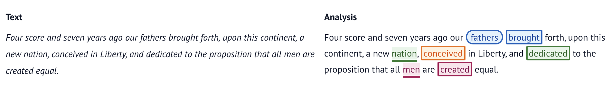

# aat

> *See [release history](https://github.com/neelsmith/aat/blob/main/releases.md)*.

`aat` is a python package leveraging LMs with `dspy` to apply a reductive model of natural-language syntax called Agent-Action-Target (AAT) to citable text in English. The AAT model is documented in [`aat-model.md`](https://github.com/neelsmith/aat/blob/main/aat-model.md).

Documentation is being added on the project's [github pages](https://neelsmith.github.io/aat/aat.html). (Currently includes several pages of AI slop that need to be edited.)

See the [project issue tracker](https://github.com/neelsmith/aat/issues) for known gaps and work in progress or to submit an issue.

Released under the [GNU General Public License v3 or later](LICENSE).

## An example

> Four score and seven years ago our fathers brought forth, upon this continent, a new nation, conceived in Liberty, and dedicated to the proposition that all men are created equal.

**Analysis viewed with `graphviz`**:

**The same analysis highlighted in its textual context**:

