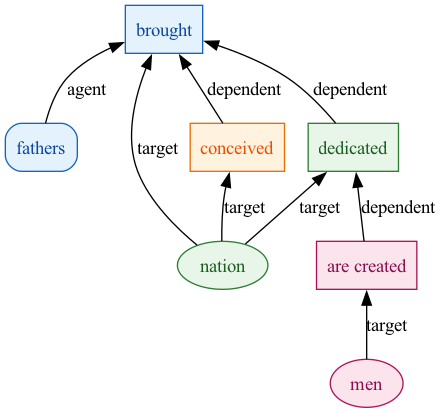

From a terminal, it's easy to work with AAT analyses using standard I/O redirection.


If you want to create a graphviz `dot` file directly from an analysis (rather than saving the analysis to a file, and later using that), you can just pipe the output of `aat_main.py` into `aat_to_dot.py`:

```python
python3 aat_main.py --passage "Four score and seven years ago our fathers brought forth, upon this continent, a new nation, conceived in Liberty, and dedicated to the proposition that all men are created equal." | python3 aat_to_dot.py   > lincolnanalysis.dot
```

If you have graphviz installed on your system, you can extend the pipeline to create an image file in a single line:


```python
python3 aat_main.py --passage "Four score and seven years ago our fathers brought forth, upon this continent, a new nation, conceived in Liberty, and dedicated to the proposition that all men are created equal." | python3 aat_to_dot.py  | dot -Tpng -o gburg.png
```

That's how this image was created:



